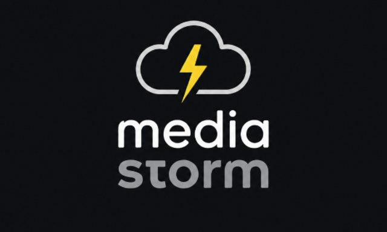

<p align="center">

</p>

# mediastorm

mediastorm is a self-hosted streaming platform for movies, television, and live TV. It combines Usenet, debrid services, personal media libraries, and IPTV sources behind native iOS, tvOS, Android, and Android TV apps, plus a browser-based web app.

Features include multi-profile watch history and recommendations, kids profiles, offline downloads, Live TV and DVR, subtitles, casting, Watch Together rooms, and encrypted Iroh connection invites for remote access.

[Releases](https://github.com/godver3/mediastorm/releases) · [Discord](https://discord.gg/kT74mwf4bu) · [iOS TestFlight](https://testflight.apple.com/join/8vCQ5gmH) · [tvOS TestFlight](https://testflight.apple.com/join/X9bE3dq6)

## Features

- **On-demand streaming:** Search multiple Usenet and torrent sources, rank releases, and stream through built-in Usenet or supported debrid providers.
- **Personal media libraries:** Browse and play local, Plex, and Jellyfin libraries alongside discovered content.
- **Live TV and DVR:** Use M3U playlists, Xtream Codes, Stalker Portal, or Stremio sources with EPG data and scheduled recordings.
- **Profiles and activity:** Maintain per-profile watchlists, playback progress, history, calendars, custom lists, content preferences, and recommendations. Profiles can use PINs, kids restrictions, and source-level access controls.
- **Playback:** Native playback on mobile and TV, browser playback at `/watch`, offline downloads in the mobile apps, external subtitle search, and Google Cast or DLNA playback on supported clients.
- **Connected services:** Import lists and synchronize activity with services including Trakt, Simkl, MDBList, and Letterboxd.
- **Shared viewing:** Create Watch Together rooms for other profiles or invite external browser guests.
- **Remote access:** Connect apps through encrypted Iroh invitations without opening an inbound port. VPN access remains supported and is recommended when practical.

## Supported Integrations

| Area | Supported services and protocols |
| --- | --- |
| Debrid | Real-Debrid, TorBox, AllDebrid, Premiumize, Torrin |
| Usenet streaming | Built-in NNTP, SABnzbd-compatible engines, AltMount, NZBDav/NZBDavEx, Decypharr, InfiniDysk-compatible setups |
| Usenet indexers | Newznab, Prowlarr |
| Torrent and direct-stream sources | Torrentio, Prowlarr, Jackett, Zilean, AIOStreams, Nyaa, Comet, MediaFusion, Internet Archive |
| Media libraries | Local media, Plex, Jellyfin |
| Live TV | M3U, Xtream Codes, Stalker Portal, Stremio add-ons, XMLTV EPG |
| Lists and scrobbling | Trakt, Simkl, MDBList, Letterboxd |
| Subtitles | Embedded tracks, OpenSubtitles, SubDL |
| Metadata | TMDB, optional TVDB and MDBList enrichment |
| AI recommendations | Gemini, OpenAI, Anthropic, OpenRouter, NanoGPT, LinkAPI |

Not every integration is required. A typical installation needs TMDB plus at least one content path, such as Usenet, debrid, a media library, or Live TV.

## Requirements

- A host that can run Docker Compose
- Persistent storage for PostgreSQL and the mediastorm cache directory
- A free TMDB API key for baseline movie and TV metadata
- At least one configured content source
- A mediastorm client or a modern browser for the web app

All clients require a running mediastorm backend.

## Quick Start

The repository's [`docker-compose.yml`](docker-compose.yml) is the canonical deployment example.

1. Download that file and create a `.env` file beside it:

```dotenv
POSTGRES_PASSWORD=replace-with-a-long-random-password
TZ=America/Edmonton

# Optional on Linux: run the container as the owner of the cache directory.
PUID=1000
PGID=1000
```

2. Edit the cache volume in `docker-compose.yml`:

```yaml
volumes:
  - /path/to/your/cache:/root/cache
```

If `PUID` and `PGID` are set, the selected user must already have read and write access to the cache folder. The image does not change ownership automatically. On Linux, you can prepare it with:

```bash
sudo chown -R "$(id -u):$(id -g)" /path/to/your/cache
```

3. Start the backend and PostgreSQL:

```bash
docker compose up -d
```

4. Open `http://localhost:7777/admin` and sign in with the initial credentials `admin` / `admin`. You must choose a replacement password before the first authenticated session is created.

5. Complete the first-run configuration:

   1. Add your TMDB API key under **Settings → Metadata**.
   2. Configure at least one content path: Usenet, debrid, a media library, or Live TV.
   3. Use the admin connection tests to verify the configured services.
   4. Sign into a native app or open `http://localhost:7777/watch`.

The backend health endpoint is available at `http://localhost:7777/health`.

> [!WARNING]
> Change both default passwords before relying on the server: the mediastorm `admin` password during first login and the PostgreSQL password in `.env`. Do not expose mediastorm directly to the public internet. Prefer a VPN or overlay network such as [Tailscale](https://tailscale.com/), or use mediastorm's Iroh connection invites.

> [!NOTE]
> mediastorm is developed with assistance from large language models. Best efforts are made to review security and code integrity, but the software is provided without warranty and should be used at your own risk.

### Data Storage and Upgrades

Application settings, cached metadata, stream metadata, recordings, and backup files are stored under the mounted cache directory. Accounts, profiles, watch history, playback progress, and other relational user data are stored in PostgreSQL.

When upgrading an older installation to PostgreSQL, mediastorm migrates supported JSON data on first startup. Original JSON files are preserved with a `.migrated` suffix in the cache directory.

Use **Admin → Backups** to create, download, restore, or schedule application backups. Also protect the PostgreSQL volume and cache directory as part of the host's normal backup strategy.

## Web and Native Clients

The server provides three browser entry points:

- `http://localhost:7777/admin` — server setup, connections, users, tasks, backups, and diagnostics
- `http://localhost:7777/account` — account management
- `http://localhost:7777/watch` — consumer web app and browser playback

### iOS and tvOS

Available on TestFlight:

- iOS: [Join TestFlight](https://testflight.apple.com/join/8vCQ5gmH)
- tvOS: [Join TestFlight](https://testflight.apple.com/join/X9bE3dq6)

Incremental updates are delivered automatically through OTA updates. Native changes require updating through TestFlight.

### Android and Android TV

- Android Mobile: [Download APK](https://github.com/godver3/mediastorm/releases/download/android-latest/mediastorm-mobile.apk) — Downloader code [`3364803`](https://aftv.news/3364803)
- Android TV: [Download APK](https://github.com/godver3/mediastorm/releases/download/android-latest/mediastorm-tv.apk) — Downloader code [`7856845`](https://aftv.news/7856845)
- [Versioned release history](https://github.com/godver3/mediastorm/releases)

Incremental updates are delivered automatically through OTA updates. Native changes require downloading the latest APK or entering the permanent Downloader code for the device.

## Connection Invites and Iroh Remote Access

mediastorm includes an Iroh-based connection invite system for remote app access without opening ports or configuring a reverse proxy. Create an invite in the admin panel, share its short code, and enter that code from the app's login screen. The person connecting still needs a valid mediastorm username and password, either for the primary account or a sub-account created for them.

The backend creates a full Iroh invite and a shorter, single-use connection code. It publishes a temporary DHT rendezvous record that lets the app use the short code to locate the full invite. The record is signed with a key derived from the short code, so the public DHT record does not directly identify the backend. The app then attempts a direct or hole-punched connection and can use an Iroh relay for initial reachability when necessary.

Traffic remains encrypted between the app and the backend even when a relay forwards it. After a successful connection, the short code is claimed and cannot be reused.

Remote performance depends on network conditions and may be slower than LAN playback, particularly for high-bitrate video. When connected through an Iroh bridge, use the built-in player; external players such as VLC or Infuse are not supported on that path.

## Configuration

Most configuration is available through the admin panel at `http://localhost:7777/admin`. Configure services there instead of editing `settings.json` directly.

### Metadata and Optional API Keys

| Service | Required | Purpose | Get a key |
| --- | --- | --- | --- |
| **TMDB** | Yes | Baseline movie and TV metadata, episodes, artwork, cast, and trailers | [TMDB API settings](https://www.themoviedb.org/settings/api) |
| **TVDB** | No | Alternate episode orders, precise broadcast times, and additional aliases, artwork, and trailers | [TVDB API information](https://thetvdb.com/api-information) |
| **MDBList** | No | Ratings from multiple sources and list/scrobbling integration | [MDBList preferences](https://mdblist.com/preferences/) |
| **AI provider** | No | Personalized recommendations based on watch history and watchlist | Configure a supported provider in the admin panel |

Without TVDB, TMDB continues to provide normal movie and TV metadata. Alternate episode ordering and exact broadcast times are unavailable, and titles or assets catalogued only by TVDB may be absent.

### AI Recommendations

AI-powered **Recommended For You** shelves are optional. Supported providers are Gemini, OpenAI, Anthropic, OpenRouter, NanoGPT, and LinkAPI; the provider, model, API key, and compatible base URL are configurable under **Settings → Metadata**.

Without an AI provider, mediastorm still provides TMDB-based recommendations such as **Because You Watched**. AI recommendation results are cached per user. Availability, pricing, model names, and quotas are determined by the selected provider, so consult that provider's current documentation.

## Troubleshooting

- **Backend does not become healthy:** Run `docker compose ps`, then inspect `docker compose logs mediastorm` and `docker compose logs postgres`.
- **Permission errors:** Confirm the container user selected by `PUID`/`PGID` can write to the mounted cache directory.
- **Database errors:** Verify `POSTGRES_PASSWORD` is consistent between PostgreSQL and `DATABASE_URL`, then check that the PostgreSQL health check passes.
- **Search returns no playable results:** Add TMDB and configure a complete content path, then run the connection tests in the admin panel.
- **Web app is unavailable in a source build:** Run `npm run web:export` in `frontend/`, or set `STRMR_WEB_APP_DIR` to an exported web bundle. Published Docker images include the web app.
- **Forgotten account password:** Run `docker compose exec mediastorm ./mediastorm recover-account -master -generate` for the primary account, or replace `-master` with `-username <name>` for a sub-account.

For source development, runtime logs are written to `.logs/backend.log` and `.logs/frontend.log`. Backend runtime diagnostics are available from localhost under `/api/debug/runtime` and `/api/debug/pprof/`.

## Development

The root repository contains the Go backend, documentation, and deployment tooling. `frontend/` is a separate Git repository containing the Expo React Native application, so run and commit frontend work from that directory.

```bash
# Backend
cd backend
make run
make test
make check
make build

# Frontend
cd frontend
npm ci
npm run start
npm run start:tv
npm run test
npm run lint

# Full local stack, from the repository root
./dev.sh start
./dev.sh restart backend
./dev.sh stop
```

The main source layout is:

- `backend/handlers/` — HTTP and web handlers
- `backend/services/` — business logic and integrations
- `backend/internal/` — core infrastructure and datastore packages
- `frontend/app/` — Expo routes
- `frontend/components/` — shared React Native UI
- `frontend/services/` and `frontend/hooks/` — reusable client logic
- `frontend/modules/` — native platform modules

## Acknowledgments

Thanks to [nzbdav](https://github.com/nzbdav-dev/nzbdav) and [altmount](https://github.com/javi11/altmount) for paving the way with Usenet streaming.

Inspired by [plex_debrid](https://github.com/itsToggle/plex_debrid) and [Riven](https://github.com/rivenmedia/riven).

Special thanks to [Parsett (PTT)](https://github.com/dreulavelle/PTT) for media title parsing.

Powered by [FFmpeg](https://ffmpeg.org/) for media processing and [yt-dlp](https://github.com/yt-dlp/yt-dlp) for trailer fetching.

Native playback is powered by [KSPlayer](https://github.com/kingslay/KSPlayer) on iOS/tvOS, and [ExoPlayer](https://github.com/google/ExoPlayer) and [MPV](https://mpv.io/) on Android/Android TV.

## License

MIT
